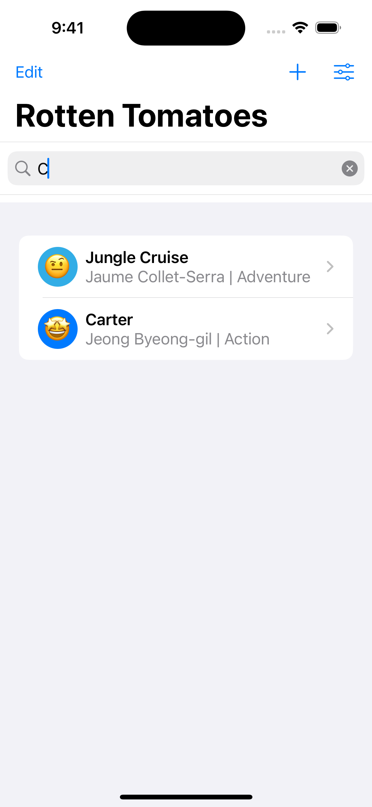
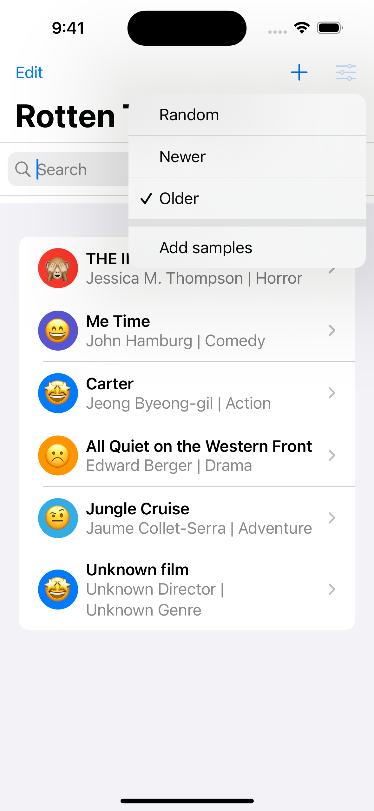
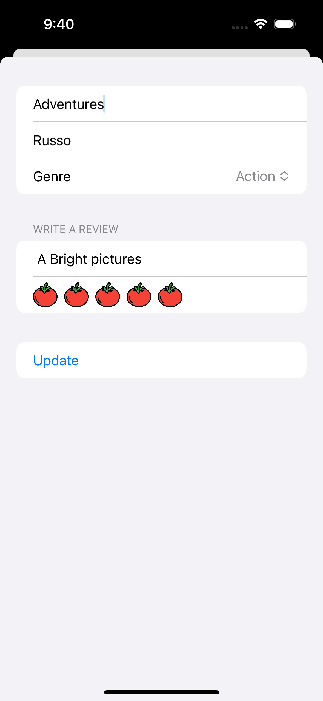
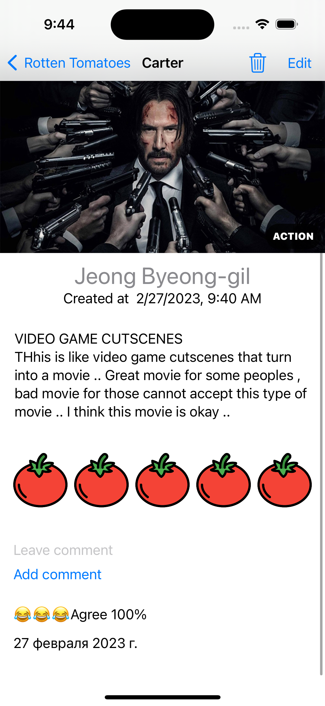

# Rotten Tomatoes (iOS, SwiftUI, CoreData)

The movie review app allows to create film review, update it, sort them, and filter them also possible to leave comments for movie review  
 

    
    

    
    

## Features

* Core Data
* One-to-many relationship between Movie and Comment entities
* Save/Delete/Update the core data object
* Fetch/Sort/Filter the core data objects